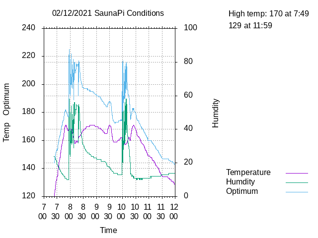

# saunaPi
Sauna temperature &amp; humidity via web page.

Uses a RaspberryPi with a temperature & humidity sensor to record these values and creates a plot as output. For example:

The "optimal" is the sum of temperature (F) & humidity. Various experts claim a value of 200 is the bestest sauna experience. As steam emits, humidity variation is high.

This project consists of three components: a C++ program to read the data, a GNU plot program to create the plot, and an Apache Web server to serve up the page.
